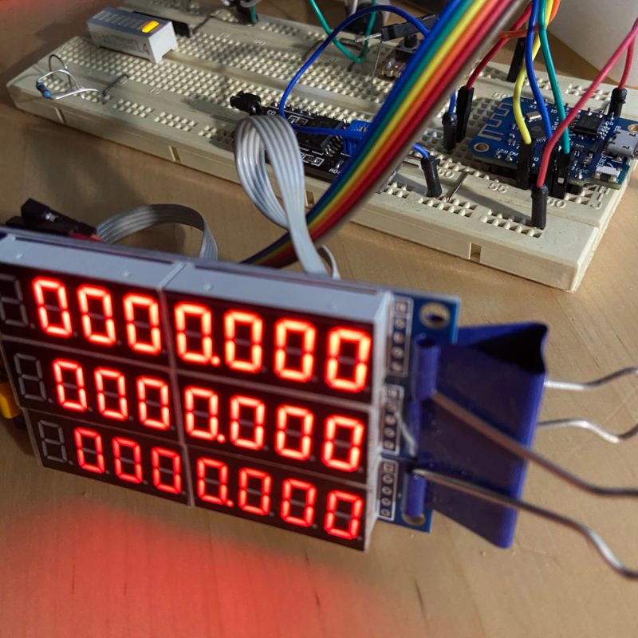

# LinuxCNC ESP8266 DRO

 

:warning: **Use at your own risk - work in progress**

## Einleitung

Basierend auf der Idee von Talla83 habe ich ein ESP8266 basierendes DRO LED Display als Prototyp
aufgebaut; die LED Segmente werden von 3 MAX7219 angesteuert, die Verbindung zu [LinuxCNC](http://linuxcnc.org/) laeuft via
WiFi und [ModbusTCP](https://github.com/andresarmento/modbus-esp8266).

[Talla83 Youtube Channel](https://www.youtube.com/user/talla83) - [Talla83 Homepage](http://www.talla83.de/) - ["CNC, Späne und Chaos" Discord](https://discord.gg/AsD3zVaeg5)

 

## Dokumente

`dro.clp`: Classic Ladder Programm fuer LinuxCNC 
`drp.hal`: HAL Datei fuer LinuxCNC, muss in der maschinen.ini eingebunden werden 
`ESP8266_Modbus_MAX7219.ino`: Arduino Source File (IDE #1.8.16 + modbus-esp8266 #4.0.0) 

Die 3 MAX 72129 sind in Reihe verkabelt ("daisy chain"), im Sketch sind die Pins vom ESP8266 
(DATA: MOSI/GPIO13, CLK: SCLK/GOIP14, CS: CS/GPIO15) vordefiniert.

